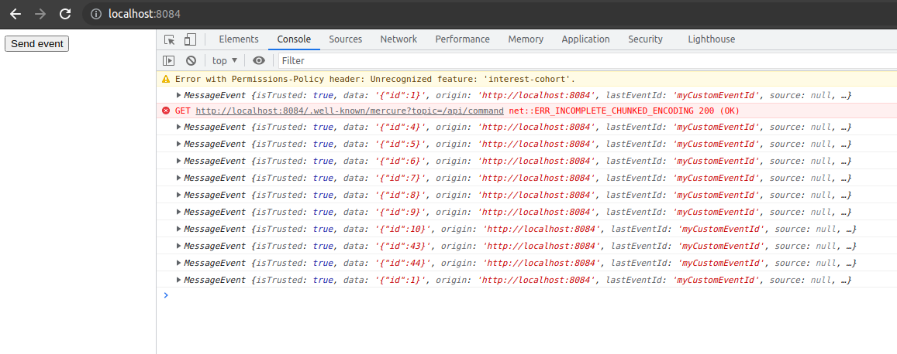

This project reproduce the bug describe here: [https://github.com/dunglas/mercure/issues/586](https://github.com/dunglas/mercure/issues/586)

### Step 1
Launch docker
```bash
docker-compose up
./runc php bin/console doctrine:database:drop --force
./runc php bin/console doctrine:database:create
./runc php bin/console doctrine:schema:update --force
```

### Step 2
Go to http://localhost:8084/

Open your console to see what is happening

And click on "Send event"

You should receive 1 MessageEvent (see in console)

### Step 3
Stop docker container (Ctrl + C)

Then launch it again:
```bash
docker-compose up
```

When the client reconnect to the mercure server it sends multiple events while it shouldn't.

### Result
This is what your console in your navigator should look like if you reproduce the previous steps:

1) Mercure shouldn't send these events after my client reconnect
2) Mercure send weird event as only one `command` has been created while I can see `id: 4`, `id: 5`, `id: 44`...
